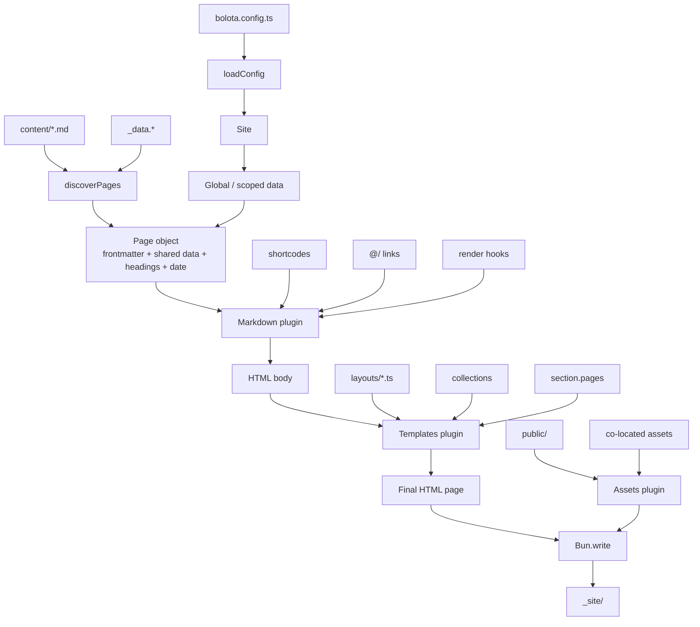

# Bolota

A minimal static site generator (SSG) powered by [Bun](https://bun.com) and vanilla TypeScript. Zero runtime dependencies, file-driven, and designed to stay simple while remaining powerful.

> **Inspirations**: [Lume](https://lume.land) · [Eleventy](https://www.11ty.dev) · [Hugo](https://gohugo.io) · [Zola](https://getzola.org)

---

## ✨ Features

| Feature | Details |
|---|---|
| **Content** | Markdown files (`.md`, `.markdown`) with YAML/TOML frontmatter |
| **Templating** | Native **JavaScript/TypeScript** layouts — no external template engine |
| **Layouts** | Convention-based defaults (`page`, `section`, `index`, `404`) + explicit `layout:` override |
| **Pretty URLs** | `content/about.md` → `_site/about/index.html` → `/about/` |
| **Data cascade** | `config.site` → global data → scoped data → `_data.*` files → frontmatter |
| **Collections** | Group pages automatically with `tags: [post]` |
| **Sections** | `content/blog/_index.md` becomes a section with `section.pages` |
| **Assets** | `public/` copied as-is + co-located assets next to content |
| **Internal links** | `[About](@/about.md)` resolves to `/about/` at build time, fragments included |
| **Shortcodes** | `{{ youtube(id="abc") }}` calls `layouts/shortcodes/youtube.ts` |
| **Render hooks** | Customize ``, `<a>`, and `<h*>` via `layouts/_markup/` |
| **Dev server** | `Bun.serve()` with SSE live-reload and auto-rebuild on changes |
| **Zero config** | Sensible defaults out of the box |
| **Zero dependencies** | Only Bun and TypeScript |

---

## 🚀 Quick start

### Prerequisites

- [Bun](https://bun.com) installed (v1.3.14+)

### Installation

```bash
git clone https://github.com/bolotaland/bolota.git
cd bolota
bun install
```

> **Dependencies**: none at runtime. Only `@types/bun` (dev) and TypeScript (peer).

### Run the example blog

```bash
cd examples/blog
bun run ../../src/cli/index.ts serve
# → http://localhost:3000
```

---

## 📁 Project structure

A Bolota project looks like this:

```
my-site/
├── bolota.config.ts      # Optional configuration
├── content/              # Markdown content files
│   ├── index.md
│   ├── about.md
│   ├── 404.md
│   └── blog/
│       ├── _index.md     # Section landing page
│       ├── first-post.md
│       └── second-post/
│           ├── index.md
│           └── hero.png  # Co-located asset
├── layouts/              # JS/TS layout functions
│   ├── page.ts           # Default layout for regular pages
│   ├── index.ts          # Homepage layout
│   ├── section.ts        # Section layout
│   ├── 404.ts            # 404 layout
│   ├── base.ts           # Custom layout
│   ├── shortcodes/       # Shortcode functions
│   │   └── youtube.ts
│   └── _markup/          # Render hooks
│       ├── render-image.ts
│       └── render-heading.ts
└── public/               # Static assets copied as-is
    └── style.css
```

After building, the generated site is written to `_site/`:

```
_site/
├── index.html
├── about/
│   └── index.html
├── 404/
│   └── index.html
├── blog/
│   ├── index.html
│   ├── first-post/
│   │   └── index.html
│   └── second-post/
│       ├── index.html
│       └── hero.png
└── style.css
```

---

## 🔄 How it works



---

## 🛠️ CLI usage

All commands are run from inside a Bolota project directory (the folder containing `content/`, `layouts/`, etc.).

```bash
# Static build
bun run /path/to/bolota/src/cli/index.ts build

# Development server: build, serve, live-reload, rebuild on changes
bun run /path/to/bolota/src/cli/index.ts serve

# Override the port
bun run /path/to/bolota/src/cli/index.ts serve --port 4000

# Help / version
bun run /path/to/bolota/src/cli/index.ts --help
bun run /path/to/bolota/src/cli/index.ts --version
```

`watch` is accepted as an alias of `serve`.

> **Note**: `build` fails hard when `bolota.config.ts` cannot be loaded — a production build never silently falls back to the default configuration. `serve` warns and continues, so you can fix the config while the server runs.

### Live reload

In `serve` mode, Bolota injects a small script into HTML responses that connects to `/__livereload` via Server-Sent Events. When a file changes, the site is rebuilt and the browser reloads automatically. Layouts, shortcodes, render hooks, and `_data.ts` modules are re-imported when they change (mtime-based cache busting).

### Error handling

A page whose transform fails (a layout that throws, a missing explicit layout, …) does not abort the build: the page is dropped, the rest of the site still builds, and the error is reported with its page and plugin.

- `build` prints every page error and exits with a non-zero status — CI never deploys a silently broken site.
- `serve` prints the errors **and shows an overlay in the browser** describing what failed. Fixing the file rebuilds and reloads automatically.
- The output directory is only cleaned after all transforms have run, so a build that dies early leaves the previous output intact.

---

## ⚙️ Configuration

Create an optional `bolota.config.ts` at the root of your project:

```ts
import type { BolotaConfig } from "bolota/config";

const config: BolotaConfig = {
  srcDir: ".",
  contentDir: "content",
  layoutsDir: "layouts",
  publicDir: "public",
  outDir: "_site",
  port: 3000,
  site: {
    name: "My Bolota Site",
    url: "https://example.com",
  },
  markdownOptions: {
    tables: true,
    autolinks: true,
  },
};

export default config;
```

Or export a function to register global data:

```ts
export default function (site) {
  site.data("year", 2026);
  site.data("layout", "post", "posts"); // scoped to posts/

  return {
    port: 3000,
  };
}
```

### Available options

The config file can be `bolota.config.ts` or `bolota.config.js`.

| Option | Type | Default | Description |
|---|---|---|---|
| `srcDir` | `string` | `"."` | Root directory for source files |
| `contentDir` | `string` | `"content"` | Directory containing Markdown pages |
| `layoutsDir` | `string` | `"layouts"` | Directory containing JS/TS layouts |
| `publicDir` | `string` | `"public"` | Directory containing static assets |
| `outDir` | `string` | `"_site"` | Output directory for the generated site (must not contain the sources) |
| `port` | `number` | `3000` | Port for the development server (`--port` overrides it) |
| `site` | `Record<string, unknown>` | `{}` | Global metadata available in all templates |
| `data` | `Record<string, unknown>` | `{}` | Global data available in all pages and layouts |
| `scopedData` | `Record<string, Record<string, unknown>>` | `{}` | Data scoped to a directory or file path |
| `markdownOptions` | `object` | — | Options passed to `Bun.markdown.html()` |

### Markdown options

Bolota uses `Bun.markdown.html()` under the hood. You can enable GitHub Flavored Markdown features:

```ts
markdownOptions: {
  tables: true,
  strikethrough: true,
  tasklists: true,
  autolinks: true,
  headings: { ids: true, autolink: true },
}
```

See the [Bun Markdown API docs](https://bun.com/docs/api/markdown) for the full list of options.

---

## 📝 Content

Content files live in `content/` and use Markdown with frontmatter.

### Frontmatter

Bolota supports three frontmatter delimiters:

**YAML** (recommended):

```md
---
title: Welcome
date: 2024-01-15
tags: [post]
---

# Welcome

Content here.
```

**TOML** with explicit marker:

```md
---toml
title = "Welcome"
date = 2024-01-15
tags = ["post"]
---

# Welcome
```

**Legacy TOML**:

```md
+++
title = "Welcome"
date = 2024-01-15
tags = ["post"]
+++

# Welcome
```

### Special frontmatter keys

| Key | Description |
|---|---|
| `title` | Page title, available in layouts |
| `layout` | Explicit layout name (overrides convention) |
| `date` | Publication date, also inferred from `YYYY-MM-DD-slug.md` |
| `tags` | Tags for collections |
| `sort_by` | Section sort order: `"date"` (newest first), `"weight"`, or `"name"` |
| `reverse` | Set to `true` to reverse the section sort order |
| `excludeFromCollections` | Set to `true` to omit from `collections.all` |

### Pretty URLs

By default, Bolota generates pretty URLs:

| Source file | Output file | Public URL |
|---|---|---|
| `content/index.md` | `_site/index.html` | `/` |
| `content/about.md` | `_site/about/index.html` | `/about/` |
| `content/blog/post.md` | `_site/blog/post/index.html` | `/blog/post/` |
| `content/blog/_index.md` | `_site/blog/index.html` | `/blog/` |
| `content/blog/2024-01-15-hello.md` | `_site/blog/hello/index.html` | `/blog/hello/` |

`page.url` is always absolute (leading `/`), so it can be used directly in `href` attributes from any depth. Date prefixes in filenames set the page date and are stripped from the slug.

### Sections

A file named `_index.md` inside a directory becomes a **section** landing page. It has access to `section.pages`, the list of regular pages in the same directory.

```md
---
title: Blog
sort_by: date
---

# Blog

Welcome to the blog.
```

```ts
// layouts/section.ts
import { escapeHTML } from "bolota/html";

export default ({ title, section, content }) => `
  <h1>${escapeHTML(title)}</h1>
  ${content}
  <ul>
    ${section.pages.map((post) => `
      <li>
        <a href="${post.url}">${escapeHTML(post.frontmatter.title as string)}</a>
        <time>${post.date ? post.date.toISOString().slice(0, 10) : ""}</time>
      </li>
    `).join("")}
  </ul>
`;
```

---

## 📊 Shared and global data

Bolota supports two data layers inspired by [Lume](https://lume.land).

### Shared data (`_data.*` files)

Create a `_data.yml`, `_data.yaml`, `_data.json`, `_data.ts`, or `_data.js` file inside `content/` or any subfolder. Its values are shared by all pages in that folder and its subfolders. Closer folders override parent folders.

```yml
# content/_data.yml
layout: base
author: Bolota
```

```md
---
title: Home
---
# Welcome
```

Available in layouts:

```ts
// layouts/base.ts
import { escapeHTML } from "bolota/html";

export default ({ author, content }) => `
  <html>
    <p>By ${escapeHTML(author)}</p>
    ${content}
  </html>
`;
```

### Global data (`site.data()`)

Inside `bolota.config.ts`, export a function that receives a `site` registry with a `data()` method:

```ts
export default function (site) {
  site.data("year", 2026);
  site.data("layout", "post", "posts"); // scoped to the posts/ directory

  return {
    // ...other config
  };
}
```

Values are passed to layouts as-is. A function value is not evaluated automatically — layouts receive the function itself and can call it.

Global data can also be declared from the object-style config:

```ts
export default {
  data: {
    year: 2026,
  },
  scopedData: {
    posts: { layout: "post" },
  },
};
```

### Data precedence

From lowest to highest priority:

1. `config.site`
2. Global data
3. Scoped data
4. Shared data from parent directories
5. Shared data from the current directory
6. Page frontmatter

---

## 🎨 Layouts and templates

Layouts are **JavaScript/TypeScript functions** stored in `layouts/`. They receive a data object and return an HTML string.

### Basic layout

```ts
// layouts/base.ts
import { escapeHTML, url } from "bolota/html";

export default ({ title, content, site, page }) => `
<!DOCTYPE html>
<html lang="en">
<head>
  <meta charset="UTF-8">
  <title>${escapeHTML(title)} — ${escapeHTML(site?.name ?? "")}</title>
  <link rel="stylesheet" href="${url("/style.css")}">
</head>
<body>
  ${content}
</body>
</html>
`;
```

> **Important**: layout authors control HTML escaping. Use `Bun.escapeHTML` or import `escapeHTML` from `bolota/html` for user-facing variables. `content` is already rendered HTML and should be inserted as-is.

### Convention-based default layouts

Bolota picks a layout automatically based on the page:

| Page | Default layout file |
|---|---|
| `content/index.md` | `layouts/index.ts` |
| `content/404.md` | `layouts/404.ts` |
| `content/dir/_index.md` | `layouts/section.ts` |
| Any other page | `layouts/page.ts` |

Use the frontmatter `layout:` key to override:

```md
---
layout: base
---
```

### Built-in helpers

Import helpers from `bolota/html`:

```ts
import { escapeHTML, url, slugify, safe, toHTML } from "bolota/html";
```

- `escapeHTML(value)` — escape HTML special characters
- `url(path)` — normalize internal URLs (`/about` → `/about/`)
- `slugify(text)` — create URL-safe slugs
- `safe(html)` — mark an HTML string as safe
- `toHTML(value)` — escape unless safe

### Template data

Inside a layout, you have access to:

| Variable | Description |
|---|---|
| `content` | The rendered HTML body of the page |
| `page` | The full `Page` object (`page.url`, `page.date`, `page.headings`, etc.) |
| `site` | Global metadata from `bolota.config.ts` |
| `collections` | Tag-based collections (`collections.all`, `collections.post`, …) |
| `section` | Section data (only for `_index.md` pages) |
| All frontmatter keys | `title`, `date`, `layout`, and any custom fields |

Example:

```ts
export default ({ title, page, content }) => `
  <h1>${Bun.escapeHTML(title)}</h1>
  <nav>
    ${page.headings.map(h => `<a href="#${h.slug}">${Bun.escapeHTML(h.text)}</a>`).join("")}
  </nav>
  ${content}
`;
```

### Partials

Because layouts are plain JS/TS modules, partials are just imports:

```ts
// layouts/partials/footer.ts
export default ({ site }) => `<footer>© ${new Date().getFullYear()} ${site?.name}</footer>`;
```

```ts
// layouts/base.ts
import footer from "./partials/footer.ts";

export default (data) => `
  <html>
    <body>
      ${data.content}
      ${footer(data)}
    </body>
  </html>
`;
```

---

## 🏷️ Collections

Group pages with the `tags` frontmatter key:

```md
---
title: Hello
tags: [post]
---
# Hello
```

In a layout:

```ts
import { escapeHTML } from "bolota/html";

export default ({ collections, content }) => `
  ${content}
  <h2>Recent posts</h2>
  <ul>
    ${collections.post.map(post => `
      <li><a href="${post.url}">${escapeHTML(post.frontmatter.title as string)}</a></li>
    `).join("")}
  </ul>
`;
```

- `collections.all` contains every page (except those with `excludeFromCollections: true`).
- `collections.post` contains pages tagged `post`.
- Collections are sorted by date, newest first; pages without a date come last.
- Each page in a collection exposes `compiledContent`, its rendered HTML body — useful for excerpts or feeds.

---

## 🧩 Shortcodes

Shortcodes extend Markdown without raw HTML. Create `layouts/shortcodes/{name}.ts`:

```ts
// layouts/shortcodes/youtube.ts
import { escapeHTML } from "bolota/html";

export default ({ id, className }) => `
  <iframe class="${escapeHTML(className ?? "")}" src="https://www.youtube.com/embed/${escapeHTML(id)}"></iframe>
`;
```

Use in Markdown:

```md
{{ youtube(id="dQw4w9WgXcQ", className="video") }}
```

Supported argument types: strings, numbers (integers and floats), booleans. Shortcodes inside fenced code blocks and inline code spans are left untouched, so you can document them safely.

---

## 🪝 Render hooks

Customize Markdown-to-HTML output with hooks in `layouts/_markup/`:

```ts
// layouts/_markup/render-image.ts
import { escapeHTML } from "bolota/html";

export default ({ src, alt }) => `
  <figure>
    
    <figcaption>${escapeHTML(alt)}</figcaption>
  </figure>
`;
```

Available hooks:

| Hook | File | Data |
|---|---|---|
| Images | `render-image.ts` | `{ src, alt, title? }` |
| Links | `render-link.ts` | `{ href, text, title? }` |
| Headings | `render-heading.ts` | `{ depth, text, slug }` |

Hooks are applied with Bun's native `HTMLRewriter`, so elements are matched structurally — attribute order does not matter. A few behaviors to know:

- Without hooks, images and links are left as rendered; headings get an `id` attribute (slugs deduplicated per document, matching `page.headings`) while keeping their inline markup.
- Hooks receive plain-text content: a heading hook on `# Hello *world*` gets `text: "Hello world"`.
- Links whose content is not plain text (e.g. image links) are never passed to `render-link` — they are left untouched rather than flattened.

---

## 🔗 Internal links

Use `@/` links to reference other Markdown files. They are resolved to pretty URLs at build time:

```md
[About](@/about.md)
[Blog](@/blog/_index.md)
[Post](@/blog/post.md)
[Team](@/about.md#team)
```

Becomes:

```html
<a href="/about/">About</a>
<a href="/blog/">Blog</a>
<a href="/blog/post/">Post</a>
<a href="/about/#team">Team</a>
```

This keeps links robust even if URLs change. A warning is printed at build time when an `@/` link points to a file that does not exist. Links inside fenced code blocks and inline code spans are left untouched.

---

## 🖼️ Static and co-located assets

### `public/` directory

Files in `public/` are copied as-is to `_site/`. Use this for:

- CSS stylesheets
- JavaScript files
- Images and icons
- Fonts
- Downloadable files
- `robots.txt`, `favicon.ico`, etc.

```
public/style.css   →   _site/style.css
public/logo.png    →   _site/logo.png
```

### Co-located assets

Keep assets next to the content that uses them, in a **page bundle** — a directory owned by an `index.md` or `_index.md` file:

```
content/blog/post/
├── index.md
└── hero.png
```

`hero.png` is copied to `_site/blog/post/hero.png`, so Markdown can use a relative link:

```md

```

Only bundles (`index.md` / `_index.md`) carry their directory's assets; siblings of a regular page like `content/blog/post.md` are not copied. `.DS_Store` and `Thumbs.db` are always skipped.

If your project doesn't need a `public/` directory, Bolota skips the copy step automatically.

---

## 🧪 Development

### Run tests

```bash
bun test
```

### Type-check

```bash
bun run typecheck
```

### Build the example

```bash
cd examples/blog
bun run ../../src/cli/index.ts build
```

---

## 🏗️ Tech stack

- **Runtime**: Bun (JavaScriptCore)
- **Language**: Strict TypeScript, native ESM
- **Markdown**: `Bun.markdown.html()` — Bun's native parser
- **Templating**: Native JavaScript/TypeScript functions
- **Render hooks**: `HTMLRewriter` — Bun's native streaming HTML parser
- **File I/O**: `Bun.file`, `Bun.write`, `Bun.Glob`
- **Server**: `Bun.serve` with SSE live-reload and error overlay
- **Tests**: `bun:test`

---

## 📜 License

MIT
