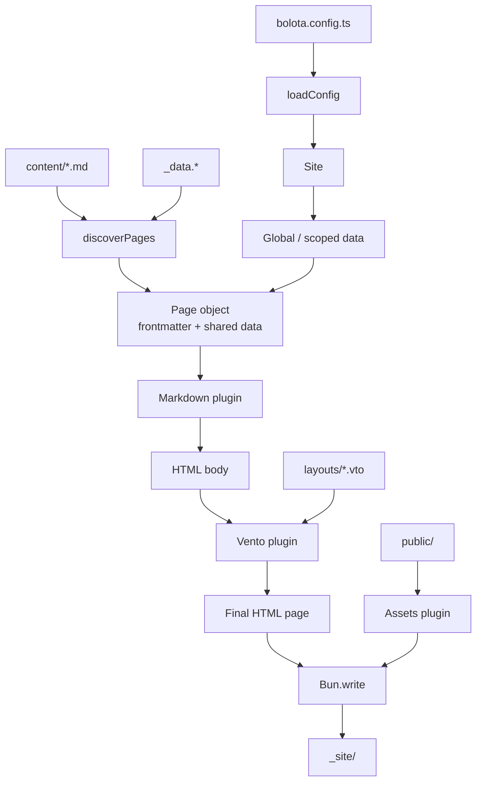

# Bolota

A minimal static site generator (SSG) powered by [Bun](https://bun.sh) and vanilla TypeScript. Built to explore Bun's native APIs while remaining fully functional and pleasant to use.

> **Inspirations**: [Lume](https://lume.land) · [Eleventy](https://www.11ty.dev) · [Hugo](https://gohugo.io)

---

## ✨ Features

| Feature | Details |
|---|---|
| **Content** | Markdown files (`.md`, `.markdown`) with YAML/TOML frontmatter |
| **Templating** | [Vento](https://vento.js.org) `.vto` templates with autoescape |
| **Layouts** | Reusable templates in `layouts/` |
| **Pretty URLs** | `content/about.md` → `_site/about/index.html` → `/about/` |
| **Assets** | Auto-copy `public/` → `_site/` (skipped if absent) |
| **Dev server** | `Bun.serve()` with SSE live-reload |
| **Watch mode** | Auto-rebuild on content, layout, or asset changes |
| **URL helper** | Built-in Vento filter for consistent internal links |
| **Auto-trim** | Optional Vento plugin to clean whitespace around control tags |
| **Zero config** | Sensible defaults out of the box |
| **Type-safe** | Strict TypeScript throughout |

---

## 🚀 Quick start

### Prerequisites

- [Bun](https://bun.com) installed (v1.3.14+)

### Installation

```bash
git clone https://github.com/bolotaland/bolota.git
cd bolota
bun install
```

> **Dependencies**: `ventojs` (template engine) + `@types/bun` (dev). That's it.

### Run the example blog

```bash
cd examples/blog
bun run ../../src/cli/index.ts serve
# → http://localhost:3000
```

---

## 📁 Project structure

A Bolota project looks like this:

```
my-site/
├── bolota.config.ts      # Optional configuration
├── content/              # Markdown content files
│   ├── index.md
│   ├── about.md
│   └── projects.md
├── layouts/              # Vento templates
│   ├── base.vto
│   ├── post.vto
│   └── projects.vto
└── public/               # Static assets (CSS, images, fonts, etc.)
    └── style.css
```

After building, the generated site is written to `_site/`:

```
_site/
├── index.html
├── about/
│   └── index.html
├── projects/
│   └── index.html
└── style.css
```

---

## 🔄 How it works



---

## 🛠️ CLI usage

All commands are run from inside a Bolota project directory (the folder containing `content/`, `layouts/`, etc.).

```bash
# Static build
bun run /path/to/bolota/src/cli/index.ts build

# Development server with live-reload
bun run /path/to/bolota/src/cli/index.ts serve

# Watch mode: server + auto-rebuild on file changes
bun run /path/to/bolota/src/cli/index.ts watch

# Help
bun run /path/to/bolota/src/cli/index.ts --help

# Version
bun run /path/to/bolota/src/cli/index.ts --version
```

### Live reload

In `serve` and `watch` modes, Bolota injects a small script into HTML responses that connects to `/__livereload` via Server-Sent Events. When a file changes, the browser reloads automatically.

---

## ⚙️ Configuration

Create an optional `bolota.config.ts` at the root of your project:

```ts
import type { BolotaConfig } from "bolota/config";

const config: BolotaConfig = {
  srcDir: ".",
  contentDir: "content",
  layoutsDir: "layouts",
  publicDir: "public",
  outDir: "_site",
  port: 3000,
  site: {
    name: "My Bolota Site",
    url: "https://example.com",
  },
  markdownOptions: {
    tables: true,
    autolinks: true,
  },
  vento: {
    autoTrim: true,
  },
};

export default config;
```

### Available options

| Option | Type | Default | Description |
|---|---|---|---|
| `srcDir` | `string` | `"."` | Root directory for source files |
| `contentDir` | `string` | `"content"` | Directory containing Markdown pages |
| `layoutsDir` | `string` | `"layouts"` | Directory containing Vento templates |
| `publicDir` | `string` | `"public"` | Directory containing static assets |
| `outDir` | `string` | `"_site"` | Output directory for the generated site |
| `port` | `number` | `3000` | Port for the development server |
| `site` | `Record<string, unknown>` | `{}` | Global metadata available in all templates |
| `data` | `Record<string, unknown>` | `{}` | Global data available in all pages, layouts and components |
| `scopedData` | `Record<string, Record<string, unknown>>` | `{}` | Data scoped to a directory or file path |
| `markdownOptions` | `object` | — | Options passed to `Bun.markdown.html()` |
| `vento.autoTrim` | `boolean \| { tags: string[] }` | `false` | Enable the Vento autoTrim plugin |

### Markdown options

Bolota uses `Bun.markdown.html()` under the hood. You can enable GitHub Flavored Markdown features:

```ts
markdownOptions: {
  tables: true,
  strikethrough: true,
  tasklists: true,
  autolinks: true,
  headings: { ids: true, autolink: true },
}
```

See the [Bun Markdown API docs](https://bun.sh/docs/api/markdown) for the full list of options.

---

## 📊 Shared and global data

Bolota supports two data layers inspired by [Lume](https://lume.land).

### Shared data (`_data.*` files)

Create a `_data.yml`, `_data.yaml`, `_data.json`, `_data.ts`, or `_data.js` file inside `content/` or any subfolder. Its values are shared by all pages in that folder and its subfolders. Closer folders override parent folders.

```yml
# content/_data.yml
layout: base
author: Bolota
```

```md
---
title: Home
---
# Welcome
```

Available in layouts:

```vto
<p>By {{ author }}</p>
{{ content |> safe }}
```

### Global data (`site.data()`)

Inside `bolota.config.ts`, export a function that receives a `site` registry with a `data()` method:

```ts
export default function (site) {
  site.data("year", 2026);
  site.data("randomNumber", () => Math.random());
  site.data("layout", "post", "posts"); // scoped to the posts/ directory

  return {
    // ...other config
  };
}
```

Global data can also be declared from the object-style config:

```ts
export default {
  data: {
    year: 2026,
  },
  scopedData: {
    posts: { layout: "post" },
  },
};
```

### Data precedence

From lowest to highest priority:

1. `config.site`
2. Global data
3. Scoped data
4. Shared data from parent directories
5. Shared data from the current directory
6. Page frontmatter

---

## 📝 Content

Content files live in `content/` and use Markdown with frontmatter.

### Frontmatter

Bolota supports three frontmatter delimiters:

**YAML** (recommended):

```md
---
title: Welcome
layout: base
---

# Welcome

Content here.
```

**TOML** with explicit marker:

```md
---toml
title = "Welcome"
layout = "base"
---

# Welcome
```

**Legacy TOML**:

```md
+++
title = "Welcome"
layout = "base"
+++

# Welcome
```

### Special frontmatter keys

| Key | Description |
|---|---|
| `title` | Page title, typically used in the `<title>` tag |
| `layout` | Name of the Vento layout to use (without `.vto` extension) |
| `date` | Publication date, available in templates |

Any other frontmatter key is passed as a variable to the layout.

### Pretty URLs

By default, Bolota generates pretty URLs:

| Source file | Output file | Public URL |
|---|---|---|
| `content/index.md` | `_site/index.html` | `/` |
| `content/about.md` | `_site/about/index.html` | `/about/` |
| `content/blog/post.md` | `_site/blog/post/index.html` | `/blog/post/` |

---

## 🎨 Layouts and templates

Layouts are [Vento](https://vento.js.org) templates stored in `layouts/`.

### Basic layout

```html
<!-- layouts/base.vto -->
<!DOCTYPE html>
<html lang="en">
<head>
  <meta charset="UTF-8">
  <title>{{ title }} — My Site</title>
  <link rel="stylesheet" href="/style.css">
</head>
<body>
  {{ content |> safe }}
</body>
</html>
```

> **Important**: because `autoescape` is enabled, raw HTML content must be piped through the `safe` filter: `{{ content |> safe }}`.

### Built-in helpers

#### `url` filter

Use the `url` filter to generate consistent internal links:

```html
<a href="{{ '/about' |> url }}">About</a>
<a href="{{ '/projects' |> url }}">Projects</a>
```

The filter converts:
- `/about` → `/about/`
- `/about.html` → `/about/`
- `./about.html` → `/about/`
- Absolute URLs and anchors are left untouched

#### Auto-trim

Vento's `autoTrim` plugin removes the blank lines and indentation around control-flow tags (`if`, `for`, `set`, etc.). It is **disabled by default** to keep output predictable.

Enable it with a boolean:

```ts
vento: {
  autoTrim: true,
}
```

Or customize which tags are trimmed:

```ts
import { defaultTags } from "ventojs/plugins/auto_trim.js";

vento: {
  autoTrim: {
    tags: ["if", "for", "set", ...defaultTags],
  },
}
```

### Template data

Inside a layout, you have access to:

| Variable | Description |
|---|---|
| `content` | The rendered HTML body of the page |
| `page` | The full `Page` object (`page.url`, `page.outputPath`, etc.) |
| `site` | Global metadata from `bolota.config.ts` |
| All frontmatter keys | `title`, `date`, `layout`, and any custom fields |

Example:

```html
<h1>{{ title }}</h1>
<p>Published on {{ date }}</p>
{{ content |> safe }}

<footer>
  <p>{{ site.name }}</p>
</footer>
```

### Includes

Vento's `include` tag works out of the box. Place reusable partials in `layouts/` and include them:

```html
{{ include "partials/header.vto" }}
```

---

## 🖼️ Static assets

Files in `public/` are copied as-is to `_site/`. Use this for:

- CSS stylesheets
- JavaScript files
- Images and icons
- Fonts
- Downloadable files
- `robots.txt`, `favicon.ico`, etc.

Example:

```
public/style.css   →   _site/style.css
public/logo.png    →   _site/logo.png
```

If your project doesn't need a `public/` directory, Bolota skips the copy step automatically.

---

## 🧪 Development

### Run tests

```bash
bun test
```

### Type-check

```bash
bun run typecheck
```

### Build the example

```bash
cd examples/blog
bun run ../../src/cli/index.ts build
```

---

## 🏗️ Tech stack

- **Runtime**: Bun (JavaScriptCore)
- **Language**: Strict TypeScript, native ESM
- **Markdown**: `Bun.markdown.html()` — Bun's native parser
- **Templating**: [Vento](https://vento.js.org)
- **File I/O**: `Bun.file`, `Bun.write`, `Bun.Glob`
- **Server**: `Bun.serve` with SSE live-reload
- **Tests**: `bun:test`

---

## 📜 License

MIT
